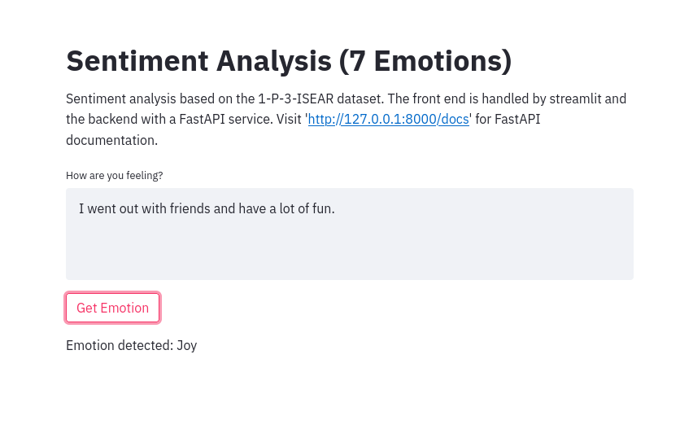
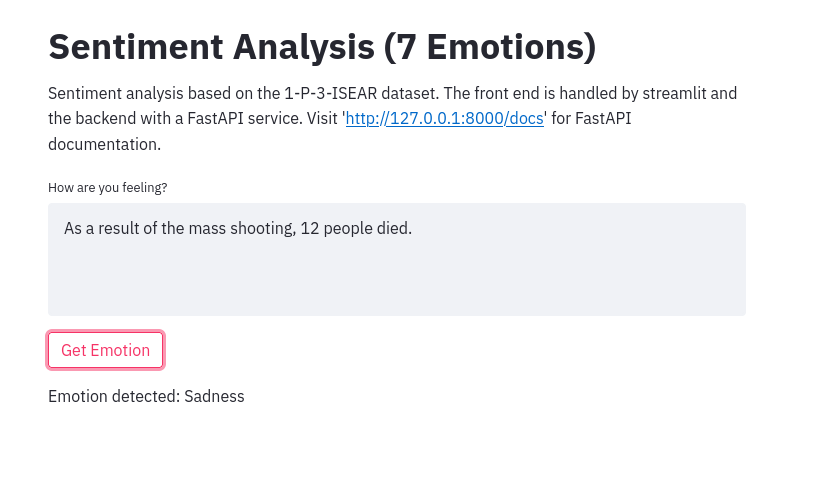

# Sentiment Classifier

Sentiment classification webapp based on the 1-P-3-ISEAR dataset. The front end is handled by streamlit and the backend with a FastAPI service.

## Instructions for Use:

1.  Install docker engine. (https://docs.docker.com/engine/install/).

For Ubuntu or similar systems, open terminal and run:

```
sudo apt-get update
sudo apt-get install docker-ce docker-ce-cli containerd.io
```

For arch linux, open terminal and run:

```
sudo pacman -Syu docker
```

2.  You need a docker service running in the background. Run command:

```
sudo dockerd
```

3.  To build the application, go to the folder containing `docker-compose.yml` and run command:

```
docker-compose build
```

4.  To run the application, run command:

```
docker-compose up
```

5.  Click on the "Network URL". You will be redirected to a web browser where the model is running.

# Screenshots



